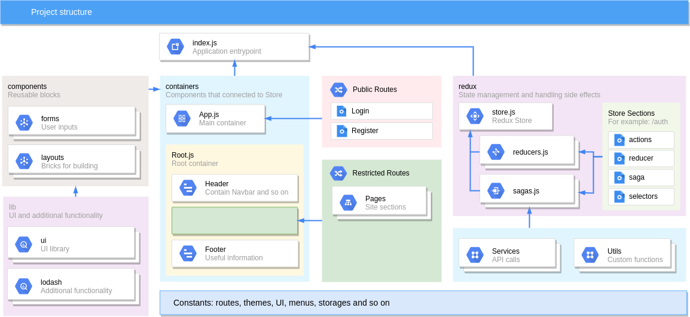

# react-app-boilerplate
A boilerplate for faster creating React applications

This boilerplate is quite workable template. It allow to:
- login user (used fake user data via `faker`)
- logout
- render header, main content and footer

There is no any UI library such as [Material UI](https://material-ui.com/),
[Ant Design](https://ant.design/) or anything else. This is intentional:
feel free to choose any your like.

## Used packages

### Routing
- [react-router](https://reacttraining.com/react-router/)
- [react-router-dom](https://reacttraining.com/react-router/)
- [connected-react-router](https://github.com/supasate/connected-react-router#readme)

### State management and side-effects
- [redux](https://redux.js.org/)
- [react-redux](https://react-redux.js.org/)
- [redux-saga](https://redux-saga.js.org)
- [reselect](https://github.com/reduxjs/reselect#readme)
- [seamless-immutable](https://github.com/rtfeldman/seamless-immutable)

### Styling
- [classnames](https://github.com/JedWatson/classnames#readme)
- [styled-components](https://www.styled-components.com)

### Handling forms
- [formik](https://jaredpalmer.com/formik/)
- [yup](https://github.com/jquense/yup)

### Custom Hooks
- [react-use](https://streamich.github.io/react-use)

### Utils
- [axios](https://github.com/axios/axios)
- [faker](https://github.com/Marak/Faker.js#readme)
- [lodash](https://lodash.com)
- [mitt](https://github.com/developit/mitt)
- [uuid](https://github.com/kelektiv/node-uuid#readme)

### Not used, but preferable
- [date-fns](https://date-fns.org/)

## Cloning and updating

To clone
```shell script
$ git clone https://github.com/daminort/react-app-boilerplate.git
```

To check updates for used packages
```shell script
$ cd <project-root>
$ npm run check-updates # will run: npx npm-check-updates
```

To update used packages
```shell script
$ cd <project-root>
$ npm run update # will run: npx npm-check-updates -u
```

## Project structure


